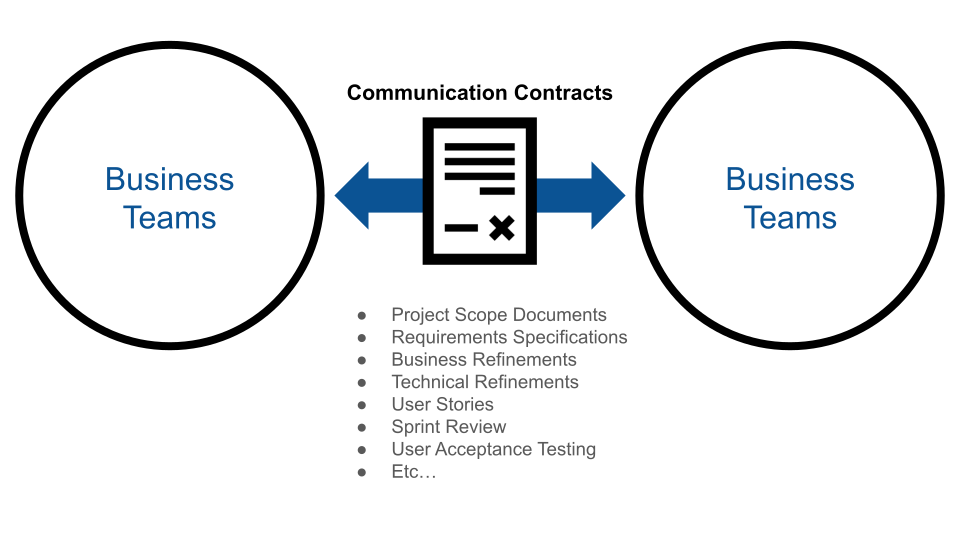
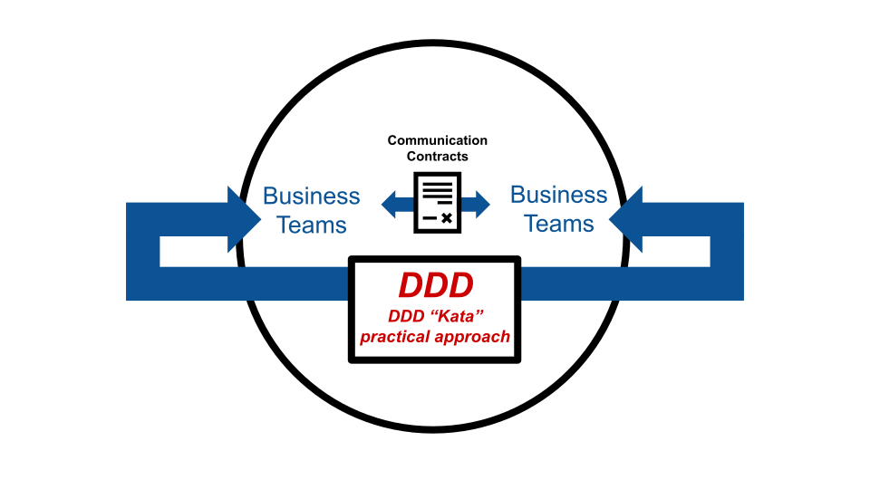
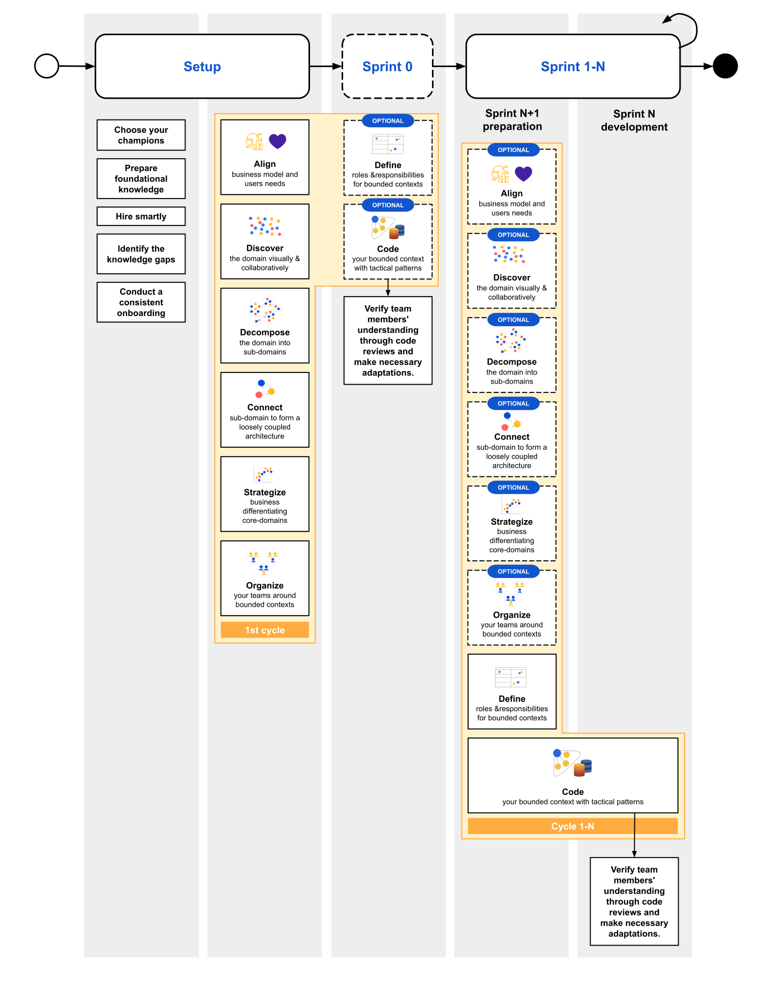
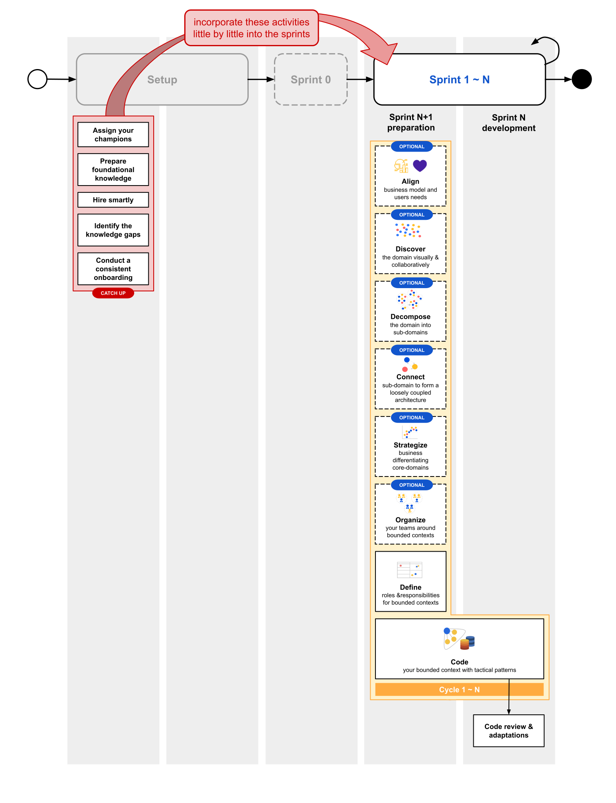
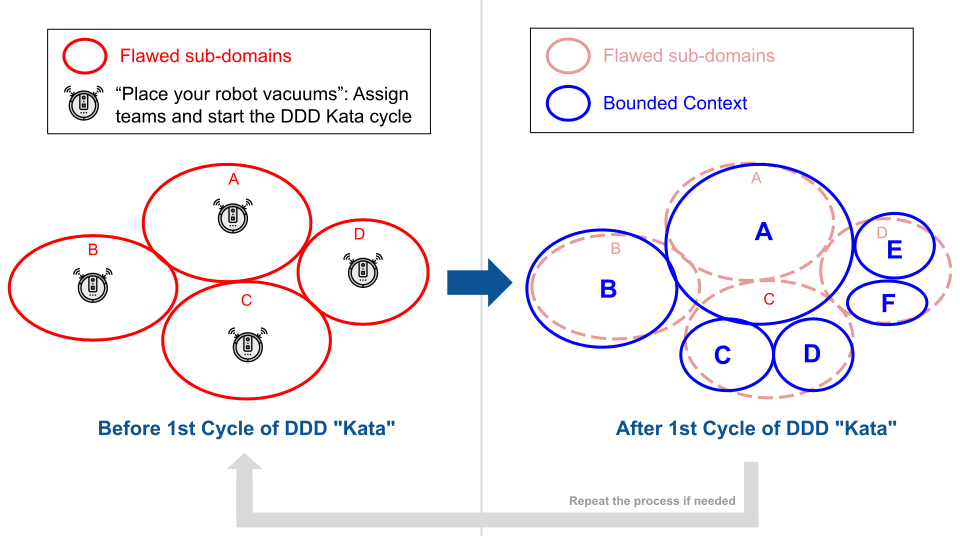
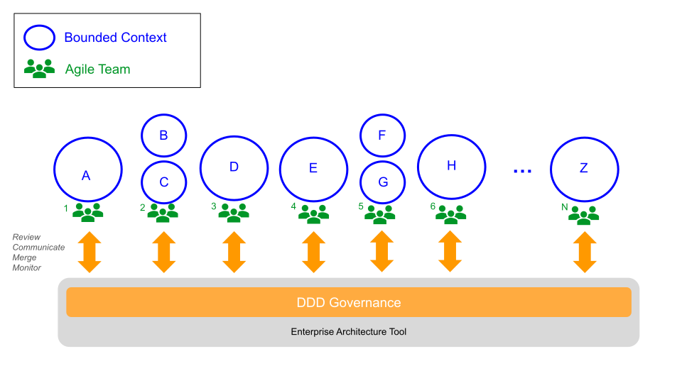

# Applying practical DDD in Agile (Scrum) teams at scale
A survival guide for applying Domain-Driven Design (DDD) within Agile teams at scale.

> Disclaimer: The following article shares insights into how Domain-Driven Design can be practically applied in multiple Agile teams.
The article's purpose is not to present a rigid recipe for applying DDD. Each team and each project has its own unique characteristics, so it is important to understand your specific context and customize these steps according to your needs.

You probably came to this article because you are interested in applying DDD in Agile teams. Perhaps you have already read Eric Evans' Blue Book and are full of excitement, or you have started applying DDD but struggled to get enough buy-in from your teams. Regardless of where you are in your journey, you likely face a common challenge: not knowing how to get started in practice with DDD in Agile. This is no surprise because DDD is a collection of principles and patterns that can sometimes feel a bit abstract. What is often missing is a practical approach to bridge the gap between theory and practice and take the first steps to get started.

This guide is based on the author's practical experience applying DDD in Agile teams at scale. It is designed to be a living document, continuously updated to incorporate new learnings gained from applying DDD.

Before proceeding, it is important to determine whether applying DDD is appropriate for your specific project. This article assumes that you have already evaluated your situation and decided that DDD is the right approach for your needs.

__Navigation__

- [First things first](#first-things-first)
- [Choose your "Kata"](#choose-your-kata)
- [Choose your coaches](#choose-your-coaches)
- [Prepare foundational knowledge](#prepare-foundational-knowledge)
- [Practical DDD in Agile Teams](#practical-ddd-in-agile-teams)
    - [Projects that have not yet started](#1-projects-that-have-not-yet-started)
    - [Ongoing projects](#2-ongoing-projects)
- [Coordinating DDD exploration across Agile teams](#coordinating-ddd-exploration-across-agile-teams)
    - [The "Robot Vacuum" approach](#the-robot-vacuum-approach)
    - [Combining DDD Outputs and Diagrams Across Teams](#combining-ddd-outputs-and-diagrams-across-teams)
    - [Choosing an Enterprise Architecture Tool](#choosing-an-enterprise-architecture-tool)
- [Conclusion](#conclusion)

## First things first
Any big program should start with clear communication and real commitment from senior management, including executives. Their support can make a significant difference when implementing large-scale programs. The mindset of an organization often mirrors the attitudes of its leadership. Supportive leaders who not only direct others but also lead by example play a key role in driving success when applying DDD at scale.

Along with the commitment from leadership, it is important to ensure that your technical teams have access to domain experts. If this access is unavailable, you should address and resolve this barrier before getting started with DDD.

It is also important to recognize that DDD is not a one-time activity but a continuous learning process. The dynamics of software, people, and businesses are constantly evolving, and so is your understanding of the domain. Adopting this mindset will help you better understand the intent of the methodology described in this article.

With that said, let's reflect on the primary goal of DDD:

> DDD aims to address software complexity by ensuring the software is closely aligned with the business domain.

You might think it is obvious. Software is meant to serve business needs and should be aligned with them, right? In theory, yes, but that is often not the case.

Generally, business teams and technical teams tend to operate as totally separate entities. This behavior is rooted in human nature. Since old civilizations, people have formed groups with others who share similar expertise and think alike. Companies are not different.

However, this separation often creates a significant gap in understanding between these people—a gap that must somehow be bridged. To address this, we typically establish communication "contracts", which vary depending on the framework being used.

In Waterfall, these "contracts" often take the form of Project Scope Documents, Requirements Specifications, and similar artifacts. In Agile, they are present as Business and Technical Refinements, User Stories, Sprint Reviews, User Acceptance Testing, and other practices.

Agile frameworks promote effective interactions between technical and business team members, ensuring that expectations, confirmations, and feedback are provided in a structured manner. However, they do not guarantee that the software will closely align with the business domain or that a DDD culture will naturally spread across your teams.

Do not misunderstand the message. When implemented effectively, Agile encourages frequent feedback loops with stakeholders, including domain experts. However, Agile alone cannot guarantee that the code will reflect the business language.

That is why we need a practical approach for applying DDD.

In Agile, there are various frameworks you can use. Please keep in mind that this article focuses specifically on Scrum-like frameworks and assumes that you are using a sprint-based development approach.

## Choose your "Kata"
One of the first steps to successfully applying DDD in Agile teams at scale is choosing the kata that best suits your needs. Kata is a Japanese word (型 or 形) meaning "form." It refers to a detailed, choreographed pattern of martial arts movements. Through repeated practice, these movements lead to mastery.

In the context of DDD, there are several approaches to follow. This article, however, is based on the ["Domain-Driven Design Starter Modelling Process"](https://github.com/ddd-crew/ddd-starter-modelling-process) created by the [DDD Crew](https://github.com/ddd-crew) community on GitHub.

## Choose your coaches
Maybe this is one of the most difficult parts: finding people who have enough energy to implement a cultural switch program at scale. Finding people with core values that suit this mission is more important than focusing on people with technical expertise only. 

Ideally, the chosen coaches should also hold leadership positions, as this can significantly smooth the process of applying DDD. (Remember the previously mentioned importance of supportive leadership).

## Prepare foundational knowledge
With your "Kata" in hand, you now have an idea of the tools and knowledge required to apply it.
If you intend to follow the "Domain-Driven Design Starter Modelling Process," the following foundational knowledge is recommended:

- Domain-Driven Design key concepts (reading a good DDD book is highly encouraged)
- Business Model Canvas
- Event Storming
- Team Topology Charts
- C4 diagrams, Context Mapping, Bounded Context Canvas, and related tools. You can check all the tools with more details in the DDD crew GitHub.

Investing in hands-on training sessions for your coaches to master these topics is highly recommended. Additionally, recommending self-paced online courses can help a broader group of Agile team members acquire this knowledge (online self-paced courses are often cheaper). Your Agile team members should feel encouraged by your DDD coaches and gradually develop an interest in the topic over time.

## Practical DDD in Agile Teams
Once you have built a solid foundation for your DDD coaches, it is time to start applying your "Kata". Remember, DDD relies on continuous interaction, the more you learn about the business, the better models you can come up with. This process often involves revisiting and revising previous decisions to incorporate new insights. Embracing a culture of continuous learning and improvement is essential for success.

The advice here is: just get started. If you are working on Agile projects, you are already familiar with cycles of adaptation and improvement. Your first attempt does not need to be perfect. Starting with something, no matter how simple, will allow you to refine and improve over time.

When you begin incorporating DDD into your Agile teams, they might be at one of those 2 different stages. 

1. [Projects that have not yet started.](#1-projects-that-have-not-yet-started)
2. [Ongoing projects.](#2-ongoing-projects)

Depending on which stage your team is, you may need to adopt different approaches.

The following picture summarizes the most common phases of an Agile project mapping out the steps of the ["Domain-Driven Design Starter Modelling Process"](https://github.com/ddd-crew/ddd-starter-modelling-process) created by the [DDD Crew](https://github.com/ddd-crew) community. 

Please remember that this is not intended to propose a rigid recipe for applying DDD. Each team and each project has its own unique characteristics, so it is important to understand your specific context and customize these activities according to your needs.

 

### 1. Projects that have not yet started.

If the target project has not yet started, there are several actions you can take during the setup phase to ensure a smooth beginning of DDD. Moreover, you have the opportunity to ensure that the software is built from scratch, adhering to DDD tactical design principles from the very first line of code.

#### Setup
In large projects, it is common to include an inception phase to organize and prepare before starting sprints, even if this phase is not formally recognized by all Agile frameworks. During this phase, activities such as creating inception decks, organizing product backlogs, and team-building are often carried out.

##### Assign your coach
This is a great time to assign the DDD coach who will lead the team.

##### Prepare foundational knowledge
It is also a good opportunity to onboard team members by providing them with foundational DDD knowledge. If team members are already assigned, ensure they receive proper training. 
 
##### Hire smartly
If hiring is an option, prioritize candidates with practical DDD experience, as they can help accelerate the team's learning process. 

##### Identify the knowledge gaps
Creating a knowledge map of the team’s current understanding of DDD is highly recommended. This allows you to customize training sessions based on specific gaps. The DDD Crew suggests the [DDD Familiarity Assessment](https://github.com/ddd-crew/ddd-familiarity-assessment) that can serve as a helpful reference.

##### Conduct a consistent onboarding
Finally, it is important to explain why the company has chosen to adopt DDD from the beginning. Providing your team with clear context and purpose will help them feel more engaged and motivated to apply DDD effectively.

##### 1st Cycle of DDD "Kata"
With all the steps above completed, you are now ready to begin exploring your business domain for the first time. Keep in mind that DDD is an iterative process, and this initial cycle serves as the first spark to accelerate the Agile team's learning curve. 

For this first cycle, it is recommended that your DDD coach take the lead, with strong support from the Agile team members.

This article will not dive into the details, as the "DDD Starter Modeling Process" already covers them. Instead, it will summarize the activities recommended at each step.

> **Align:**
A good way to get started is by inviting the Product Owner (PO) and hosting a collaborative workshop to create a Business Model Canvas (BMC) for your business domain. This activity will enable your team to make informed decisions that address real business problems.

> **Discover:**
Collaborate with your PO to run a "Big Picture" Event Storming session. Cover the entire business flow from end to end, allowing team members to familiarize themselves with business terms and clarify any initial questions.

> **Decompose:**
Use the output from the Discover phase and invite your PO and team members to draft an initial version of boundaries within your domains. The results may not be precise at this stage, but this exercise helps the team become familiar with the approach and start thinking in terms of bounded contexts.

> **Connect:**
Move to the decomposition step by creating Context Mapping diagrams to visualize how the boundaries would connect. This step helps the team understand relationships and dependencies between contexts.

> **Strategize:**
Host another collaborative workshop with the PO and the team to create Core Domain charts. This step establishes a shared understanding and awareness of which domains are core, supporting, or generic within your business.

> **Organize:**
Identify which boundaries will be the focus of your Agile team's implementation and which will not. Use a collaborative workshop to create a Team Topology Chart to visualize dependencies with external teams and systems.

Ideally, steps 1–6 of the DDD Starter Modeling Process should be completed before starting Sprint 1. If your team has a Sprint 0, it is acceptable to allocate some time during Sprint 0 to finalize these activities if they were not completed during the setup phase.

After going through the 1st Cycle, your team members should feel that they have a basic understanding of the business domain and its boundaries as well as the ubiquitous language applied in each boundary. They should feel more confident to start developing software that is driven by the business.

#### Sprint 0
The topic of whether Agile teams should have a Sprint 0 is often debated. The Scrum framework does not mention a specific sprint for setting up things like the codebase or CI/CD pipelines. However, many Agile teams use this concept. 

For this reason, Sprint 0 has been included in this article, but is marked as optional.

If you choose to have a Sprint 0, it is a good time to start coding the foundation of your software and apply tactical patterns.

##### 1st Cycle of DDD "Kata"

> **Define:**
Your team should spend time creating a Bounded Context Canvas to define clear boundaries. This helps formalize your understanding and link it to upcoming User Stories.
Another helpful step is to create C4 diagrams and share them with developers. These diagrams provide a clear view of the expected software design.

> **Code:**
Your DDD coach should support your team to conduct design-level Event Storming sessions focused on the upcoming sprint backlog. This helps the team prepare for development.
If you decide to build a structural codebase, developers can start applying tactical design patterns to the code.

##### Code Review & adaptations
At this stage, ensure that the code created aligns with the strategic design. 

The ubiquitous language and the domain model (Entities, Value Objects, Aggregates, etc.) should be correctly applied.

Senior developers and architects should review pull requests to check the team's work. If any gaps are found, they should take steps to address them.

This continuous review process helps the team learn from mistakes and create actionable items to solve identified issues.

#### Sprint 1 ~ N
During sprints, your team will focus on two main types of tasks. 

The first type involves preparing for the next sprint. In Agile projects, this is often called technical and business refinement. During this activity, the team prepares user stories and ensures that the sprint backlog for the upcoming sprint is ready for development. These tasks are usually handled by the PO and an architect or senior developer.

The second type of task is implementing the current sprint's scope, which is done by the developers.

Ideally, these 2 activities happen at the same time. While the team implements the current sprint, they also continuously prepare for the next sprint. This approach helps maintain a smooth and consistent delivery process.

Applying DDD does not mean you need to change your Agile framework. Instead, it is about integrating DDD principles into the existing rituals and activities of your framework. The following part explains how the DDD steps can be incorporated into your sprints. 

##### Cycle 1 ~ N

###### Sprint N+1 preparation

Assuming you have completed the first exploratory cycle of your DDD Kata, your team should now have some familiarity with the approach. This is a good time to shift the DDD leadership from your DDD coach to the architect or a senior developer. If the team does not seem ready, it is perfectly fine to keep the coach involved for a few more cycles to provide support.

> **Align, Discover, Decompose, Connect, Strategize and Organize:**
The steps "Align," "Discover," "Decompose," "Connect," "Strategize," and "Organize" are marked as optional, but do not misunderstand this. This label means you should evaluate the sprint backlog for upcoming sprints, check if the scope of the current work might impact decisions from the last DDD Kata cycle, and decide which steps need to be revisited. Always analyze the current project situation and use your judgment to choose the steps that require further refinement. There are no strict rules—this is more of an intuitive process.

For example, let us say your first Kata cycle mapped the entire e-commerce flow, from a user viewing a product on the website to the order being fulfilled. Now, in the upcoming sprint, you plan to implement the shopping cart feature. Since this part of the system has more details, it would be helpful to revisit the "Discover" step to refine your Event Storming diagrams. During this process, you might identify new bounded contexts. If that happens, it would make sense to repeat the "Connect" step to define these contexts. If this work involves interactions with a new team that was not previously identified, you should also revisit the "Organize" step to update your Team Topology Charts with the new information.

Remember, DDD is an iterative process that requires regular adjustments based on your project’s needs.

> **Define:**
Your team should take time to create a Bounded Context Canvas to clearly define boundaries for the upcoming sprint. This helps ensure a better understanding of the scope and connects it to the User Stories for the sprint.
It is also helpful to create C4 diagrams and share them with the developers. These diagrams give a clear picture of the expected software design, always focusing on the scope of the upcoming sprint.

> **Code:**
As part of preparing for sprint n+1, it is a good idea to explore the sprint’s scope further by holding design-level Event Storming sessions with the team and the Product Owner (PO). These sessions help the Agile team identify key domain model components, such as entities, aggregates, and value objects. The conclusions from these discussions should be documented and attached to the User Stories so developers can implement them in the next sprint. These conclusions can also be added to the C4 diagrams to clearly communicate the architecture to all team members.
It is important to note that you are encouraged to revisit any DDD Kata steps whenever new conclusions affect earlier decisions from previous cycles. This is part of the process—each time you learn more about the domain, you can refine your solutions by revisiting and improving previous decisions.

###### Sprint N development

During Sprint N, developers focus on implementing the backlog items that were prepared in the previous sprint. This process assumes a certain level of confidence in the designed architecture. 

> **Code:**
In real-world scenarios, it is not always possible to have all the details perfectly defined upfront. Therefore, it is perfectly acceptable to refine your understanding of the building blocks of your domain model and make necessary adjustments at this stage. If your findings impact the earlier steps of the DDD Kata, it is important to take the time to update your artifacts to align with these new insights.

> **Code Review and Adaptations**
Once the user story has been implemented according to the defined guidelines, the developer should submit a pull request. It is highly recommended that senior developers or architects review these pull requests to ensure that the code aligns with DDD principles and practices.
This continuous review process serves as a learning opportunity for the team, allowing them to identify mistakes, share knowledge, and create actionable items to address any issues uncovered.

### 2. Ongoing projects.

#### Sprint 1 ~ N
For ongoing projects, the process is quite similar to what has already been described in this article. The main difference is that you may not have enough time for thorough preparation, so you will need to adjust and catch up during the sprints. It is advisable to gradually incorporate the setup activities into your sprints over time.

Another key difference is that the code may already exist. In this case, findings and conclusions from the "Code" step will likely lead to necessary code refactoring. This should be treated as technical debt that must be planned and addressed appropriately.

On the other hand, for new implementation scopes, you have the opportunity to plan and develop using the "DDD way" from the start, avoiding the continued propagation of technical debt.

 

### Coordinating DDD Exploration Across Agile Teams
Applying DDD at scale in a large business domain involving over 20 Agile teams can seem overwhelming. Identifying where to begin is often the first challenge. In many cases, the complexity of the business makes it impractical to explore the entire domain in just 2 or 3 days.

For such scenarios, it is important to adopt a good strategy that enables you to gradually uncover the domain's complexities. As you progress, clearer boundaries will emerge through exploration and iteration.

#### The "Robot Vacuum" approach
This process is similar to using a robot vacuum for the first time. When you initially activate it, you place it randomly in the middle of a room. It starts mapping the space by moving around, hitting walls, and gradually building a detailed understanding of the room's layout. Over time, it memorizes the structure of the walls and spaces in your home.

 

The first DDD cycle is like initializing a robot vacuum. Agile teams are tentatively assigned to sub-domains based on your initial sub-domain concept that exists in the business organization. As the teams work through cycles of DDD exploration, they learn more about the true/ideal boundaries of the domain. This may lead to adjustments in team assignments and scope, which is perfectly acceptable. DDD is inherently an iterative process, and Agile emphasizes cycles of learning and adaptation.

Starting sooner rather than later allows you to make mistakes, learn from them, and correct course as needed. The quicker you begin, the quicker you can adapt and move forward.

Each subsequent DDD cycle is like running your robot vacuum through the newly discovered room layout. However, unlike static rooms, software, people, and businesses are dynamic and constantly evolving. As you gather more information about your socio-technical organization, your understanding deepens, and the "room walls" should be continuously adjusted.

 

#### Combining DDD Outputs and Diagrams Across Teams

The "robot vacuum" approach described above can help you get started. However, when multiple teams work in parallel within a continuous learning cycle, coordination is often needed to maintain consistent diagrams across the organization.

For large-scale programs, it is important to establish a governance process to ensure the consistency of outputs and interfaces across different boundaries. Regularly monitoring these interfaces is essential. Teams should be promptly informed about any changes to interfaces that affect their bounded contexts.

You must be careful to avoid concentrating too many decisions in the hands of a small group of people. A well-designed governance process should have a balance between maintaining control and empowering Agile teams to make their own decisions. Excessive control can hinder the teams' agility and slow down progress.

#### Choosing an Enterprise Architecture Tool

The governance process will vary depending on the project and should be tailored to your specific needs. To support this process, using an enterprise architecture tool is highly recommended. Here are a few options:

- SAP LeanIX
- Ardoq
- Bizzdesign Horizzon

 

## Conclusion
Applying DDD within Agile teams at scale is an ongoing journey rather than a one-time event. As organizations grow, so do their domain complexities, and embracing DDD’s iterative, business-aligned mindset helps ensure that both software and teams evolve together. 

The principles and techniques described here—ranging from initial modeling exercises to continuous refinement cycles—are not rigid mandates but suggestions based on the author's experience applying DDD at scale. Each team’s unique context may call for adjusting the frequency of workshops, experimenting with different modeling tools, or fine-tuning governance approaches.

Aligning leaders, coaches, developers, architects, and business stakeholders is key to sustaining a DDD culture. Over time, as your teams gain proficiency, the domain model will stabilize, communication gaps will narrow, and your software will more accurately reflect the business domain it serves. 

Ultimately, by integrating DDD thinking into Agile practices, you can build more maintainable, meaningful software solutions that continuously adapt to evolving business needs.