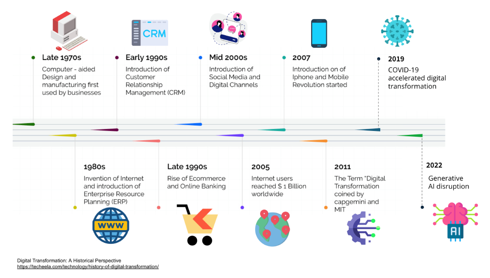
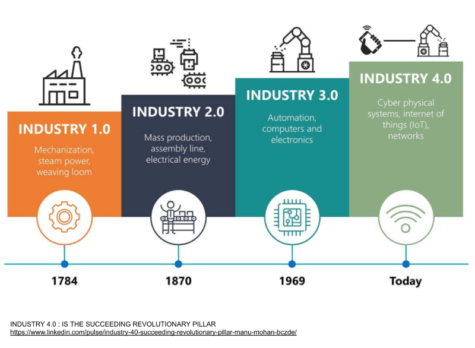
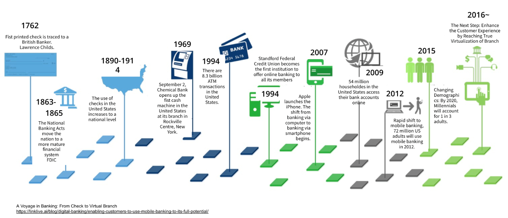
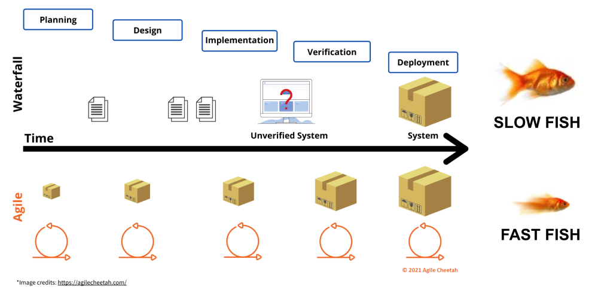
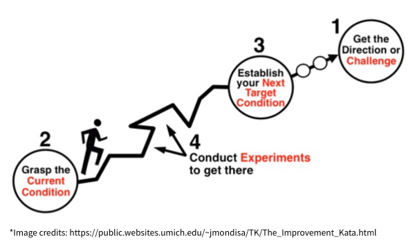
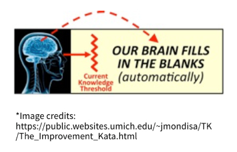
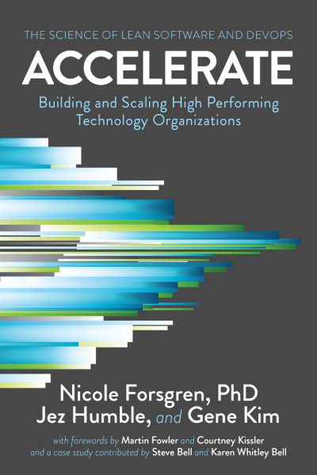

 

[Home](../../) » Articles » How Lean and Agile Drives Success in Software Development for the Digital Era

# How Lean and Agile Drives Success in Software Development for the Digital Era

The world is changing rapidly. From manufacturing to finance, entire industries have undergone massive transformations driven by technology. As companies embrace digital transformation, leaders and technical teams are required to innovate faster, eliminate waste, and continuously adapt to stay ahead of the competition. In this environment, Lean, once associated primarily with the automotive industry, has emerged as an essential approach not only for manufacturing but also for software development.

This article provides an introduction to Lean principles in software development within modern software organizations. It discusses the evolution of digital transformation, explores how Lean fits alongside Agile principles, and then moves on to practical ways of applying these methods. It also includes an overview of "capability models" as a helpful "sensor" for continuous improvement.

## Digital Transformation: A Reality Check

### Milestones of Digital Disruption

Digital changes have been happening for many years, but big events like the COVID-19 pandemic (2020–2021) made them speed up quickly. Then, in late 2022, the public release of ChatGPT brought generative AI into the spotlight, showing just how fast artificial intelligence can change the way businesses work and what customers expect. This AI leap added another major wave of disruption, and it shows no signs of slowing down. As a result, companies must be prepared to adapt quickly and stay flexible.

The following timeline illustrates a few key milestones that shifted consumer behavior:

 

### Impact on Traditional Industries

Technical advancements have impacted nearly every industry. By focusing on any industry segment, you can create a timeline of transformation that runs parallel to technological progress. Here are some examples of how they have transformed different fields:

Manufacturing: The evolution of “Industry 4.0” integrates robotics, IoT sensors, and data analytics to optimize production. Toyota’s Production System, a significant precursor to Lean, inspired countless industries to adopt continuous improvement practices.

 

Banking: Financial services evolved from physical checks and ATMs to online banking, then to an era where entire customer journeys can happen via smartphone apps. Gen Z users now demand hyper-personalized, near-instant experiences—forcing banks to modernize systems at an unprecedented pace.

 

## A New World of Fast vs. Slow

*“In the new world, it is not the big fish which eats the small fish, it’s the fast fish which eats the slow fish.” — Klaus Schwab.*

Companies that can adapt quickly, like Uber in the transportation industry, have the ability to disrupt and even replace long-established market leaders. On the other hand, companies that fail to adapt, such as Blockbuster and Kodak, face serious consequences like collapse or prolonged struggles to survive in the digital age. The key takeaway is clear: achieving and maintaining success today requires continuous, data-driven adaptation and innovation.

In a world where technology drives innovation, software has become the primary means of delivering value across most industries. The speed at which companies can innovate now depends largely on how quickly they can develop, test, and deploy software into production. Faster deployment means faster learning, improvement, and ultimately, a stronger competitive edge.

## Lean and Agile: Ways to Work Faster and Adapt

In this context, Lean and Agile provide effective methods for achieving speed and flexibility in software development. These approaches focus on breaking down large, complex projects into smaller, manageable pieces, allowing teams to deliver value more frequently and respond quickly to changes. By encouraging continuous improvement, customer feedback, and collaboration, Lean and Agile help organizations adapt faster to market demands and technological advancements. This ability to rapidly develop and deploy software becomes a key factor in staying competitive in today's fast-paced, innovation-driven world.

### Lean
Lean focuses on delivering maximum value to customers while reducing waste. It began with Toyota's Production System and has since become a widely used approach in many industries. Lean emphasizes continuous testing, fast feedback, and problem-solving with a strong focus on people and teamwork. By constantly improving processes, companies can deliver products and services more quickly, with higher quality, and by using fewer resources. This helps businesses stay efficient, adaptable, and better prepared to meet customer needs in a changing world.

### Agile
While Lean originated in manufacturing, Agile was developed in the software industry to address the problems of slow and inflexible methods, such as the traditional Waterfall approach. Agile focuses on working in short cycles, called iterations, with frequent feedback from customers and stakeholders. This allows teams to make continuous improvements and quickly adapt to changing needs.

Like Lean, Agile emphasizes speed, flexibility, and ongoing improvement. When used together, Lean and Agile create a powerful combination. Lean helps improve processes by reducing waste and increasing efficiency, while Agile ensures that work is delivered in small, manageable steps. This approach allows companies to deliver value faster, respond quickly to changes, and continuously enhance both products and processes.

### Kaizen for Continuous Improvement
Kaizen is a Japanese word that means 'continuous improvement.' It often serves as the cultural foundation that connects both Lean and Agile. Instead of relying on large, infrequent changes, Kaizen focuses on small, regular improvements made over time. This approach helps businesses stay flexible and constantly move forward.

Kaizen typically follows a structured cycle known as PDCA (Plan-Do-Check-Act) or the Improvement Kata, which encourages systematic problem-solving and learning:

> Plan: Identify a clear goal and a possible improvement by understanding the current situation thoroughly.

> Do: Implement a small change or run a test to try out the idea.

> Check: Measure the results using data to understand what worked and what did not.

> Act: If the change proves successful, make it the new standard. If not, adjust the approach and try again.

The Improvement Kata teaches teams to think scientifically. This means testing ideas instead of relying on guesses or quick conclusions. It helps people compare their expectations (theory) with actual outcomes (evidence) and adjust based on what they learn. This way of thinking improves problem-solving and helps teams achieve their goals in uncertain situations.

However, scientific thinking is not automatic. It takes practice. Most of the time, people naturally jump to conclusions without testing their ideas. The Improvement Kata changes this habit through regular practice. Organizations use simple training routines, called "Starter Kata", to help teams and leaders develop these habits. Over time, practicing the Improvement Kata builds a culture of continuous improvement where everyone, from junior developers to senior leaders, contributes to making better processes and outcomes.

Though Kaizen may seem simple, it is incredibly effective. By focusing on small, data-driven improvements, it prevents processes from stagnating and helps create a culture of continuous progress. This mindset encourages everyone to take part in improving both processes and outcomes. Over time, these small improvements build up, driving long-term success and innovation.

## The Science Behind Lean and DevOps

Research from the book Accelerate shows a strong connection between Lean, DevOps, and the success of top-performing tech companies. These companies excel by focusing on key practices such as short lead times, continuous delivery, and effective tracking of progress and performance.

Short lead times allow teams to quickly move from idea to implementation, reducing delays and enabling faster feedback from users. Continuous delivery ensures that software updates are released frequently and reliably, minimizing risks and keeping the product fresh and relevant. Good tracking practices provide clear visibility into progress, helping teams identify issues early and make data-driven decisions.

By combining these practices, companies can deliver high-quality software features faster—meeting the expectations of modern users who demand speed, reliability, and constant improvements. This approach not only boosts customer satisfaction but also strengthens a company’s ability to compete and innovate in rapidly changing markets.

## Building an Architecture Process

In software development, the architecture of a system plays a big role in how flexible and efficient a team can be. Good architecture helps teams adapt quickly and deliver value without getting stuck in complicated designs. When architecture is combined with Lean and Agile practices, teams can avoid rigid, heavy upfront planning. Instead, they can build systems step by step, using short feedback loops to learn and improve continuously.

For companies aiming to succeed in digital transformation, strong architecture processes are essential. These processes ensure that modern practices like DevOps are built into applications right from the design phase. DevOps focuses on automating, testing, and releasing software faster and more reliably. However, for DevOps to work well, architecture must support quick iterations and easy changes.

To make this possible, architecture processes should reflect key ideas from Lean. These include reducing waste, improving flow, and promoting continuous improvement. Companies should embed these ideas into their daily tasks and workflows. This means fostering behaviors and mindsets that encourage collaboration, fast feedback, and ongoing learning.

Strong architecture does not just define technical capabilities—it also shapes how teams work and solve problems. It provides a foundation that allows teams to scale, innovate, and stay competitive. By aligning architecture with Lean and Agile principles, companies can continuously improve their systems, speed up development, and meet customer needs more effectively.

## Capability models

To make processes consistent and scalable, it is helpful to use frameworks based on the PDCA (Plan-Do-Check-Act) cycle. These frameworks help ensure that teams are applying processes correctly and continuously improving. As organizations grow, they often need a simple, structured way to track and promote best practices. One effective method is to use capability models.

A capability model is a set of "yes/no" questions or survey items that teams regularly answer. These questions focus on key practices, behaviors, and capabilities that teams need to have in order to deliver value quickly and effectively. By reviewing the answers, teams can identify strengths and areas for improvement. This model serves as a great starting point for discussions during PDCA meetings, where teams plan next steps based on data and insights.

The process works like this: teams gather data to understand their current situation, compare it to where they want to be, and make plans to close the gap. Over time, repeating this exercise helps teams consistently improve their capabilities. This regular reflection and action can lead to significant improvements in how teams work, resulting in faster delivery, better collaboration, and real cultural change.

By using capability models and applying PDCA consistently, organizations can create a strong foundation for continuous improvement. It enables teams to focus on what truly matters, align their efforts, and build habits that support long-term success.

Capability models can be a valuable tool to support continuous improvement by focusing on the key capabilities that help your company become a high performer. However, if not used correctly, they can be harmful and create negative outcomes.

The danger lies in using these models to assign blame rather than to guide and support teams. If teams feel judged or pressured by the results, it can lead to fear, resistance to change, or hiding problems instead of addressing them. This defeats the purpose of continuous improvement, which is meant to encourage open learning and growth.

To avoid this, it is important to understand the true purpose of the indicators in the model. These indicators should be used as a starting point for reflection and discussion, not as a tool for punishment. The goal is to help teams see where they can improve, celebrate their progress, and learn from any challenges they face. Leaders should create a supportive environment where teams feel safe to share their struggles and successes.

When used wisely, capability models can drive meaningful improvements by encouraging collaboration, trust, and learning. This approach helps teams focus on achieving their goals and fosters a culture of continuous improvement across the organization.

### What a Capability Model should be:

1. A tool to detect potential risks early:
The model acts like a sensor, helping teams identify risks that might affect the success of a project. By spotting issues early, teams can take action before they become major problems.

2. A reminder of essential best practices:
In the rush to deliver new features, important practices such as architecture reviews, security checks, and quality assurance (QA) processes can sometimes be forgotten. The capability model serves as a helpful reminder to ensure these critical steps are not missed, maintaining both quality and safety.

3. A way to measure team improvement:
The model works as a gauge to track how a team is progressing over time. By regularly checking capabilities, teams can see if they are improving their processes, becoming more efficient, and delivering better results. This continuous feedback helps guide ongoing learning and growth.

When used this way, a capability model supports both risk management and continuous improvement, helping teams stay on track and deliver high-quality outcomes.

### What a Capability Model should not be:

1. A tool for micromanagement or shaming:
The model should never be used to control or criticize teams. It is meant to support and guide them, not to create fear or blame. Using it to micromanage can damage trust, lower morale, and discourage open communication, which hinders progress.

2. An absolute measure of success:
A high score in a capability model—such as a high PML (Performance Maturity Level) score—does not guarantee success. Every project and team operates within its own unique context. What works well in one situation may not apply in another. It is essential to interpret the results with flexibility and an understanding of the broader circumstances.

3. A complete solution on its own:
The model is most effective when used as part of a larger system of continuous improvement. It should be combined with practices like Kaizen cycles, retrospectives, and proper coaching to provide teams with the tools and support they need to grow and improve. Without these additional processes, the model may fail to drive meaningful change.

By avoiding these pitfalls, the capability model can remain a helpful tool that promotes learning, teamwork, and sustainable success.

### Interpreting "capability scores"

Lean managers and tech leads can think of a team's capability score like an airplane's altitude gauge. It gives an idea of how "high" or mature the team is in certain areas, but whether that is good or bad depends on the situation.

For example, a project with a low capability score, such as "Level 1", might be perfectly acceptable if it is a small proof-of-concept. In this case, the focus may be on speed and experimentation rather than full maturity. On the other hand, a larger enterprise system with a higher capability score, like "Level 3", may still require a closer look at key areas, such as security or scalability, to ensure nothing critical is overlooked.

This means that capability scores should never be viewed in isolation. Always consider the full context of the project, team goals, and business needs before making decisions based solely on the scores. The score is a guide to help teams identify where they stand, but thoughtful interpretation is crucial for making the right improvements.

## Final Thoughts

Digital transformation is not slowing down. Companies must keep up with new technology and changing customer needs. Lean and Agile can help teams work faster, reduce waste, and focus on what matters most. By breaking big tasks into smaller steps and asking for feedback often, teams can deliver better results in less time.

Kaizen, or continuous improvement, reminds us that small changes add up to big wins. DevOps practices, like continuous delivery, also help teams release updates faster and with fewer problems. Capability models offer a simple way to check how well teams follow these good practices. But remember, these tools should guide and support people, not punish them.

In the end, success in today’s digital world comes from a mindset that values learning, teamwork, and constant improvement. When leaders and teams share this mindset, they can adapt to change, stay competitive, and keep customers happy.

## References & Further Reading

- Accelerate: The Science of Lean Software and DevOps – Nicole Forsgren, Jez Humble, and Gene Kim
- How Kodak Failed – Forbes article
- Blockbuster's Digital Demise – Factr.me blog
- Digital Banking Evolution – LinkLive.ai blog
- Industry 4.0 – LinkedIn Article
- True Gen: Generation Z and its implications for companies – McKinsey & Company

---

Author: [@geovanneb](https://github.com/geovanneb)

Created on: 2025-10-02

---

[< Back](../../)